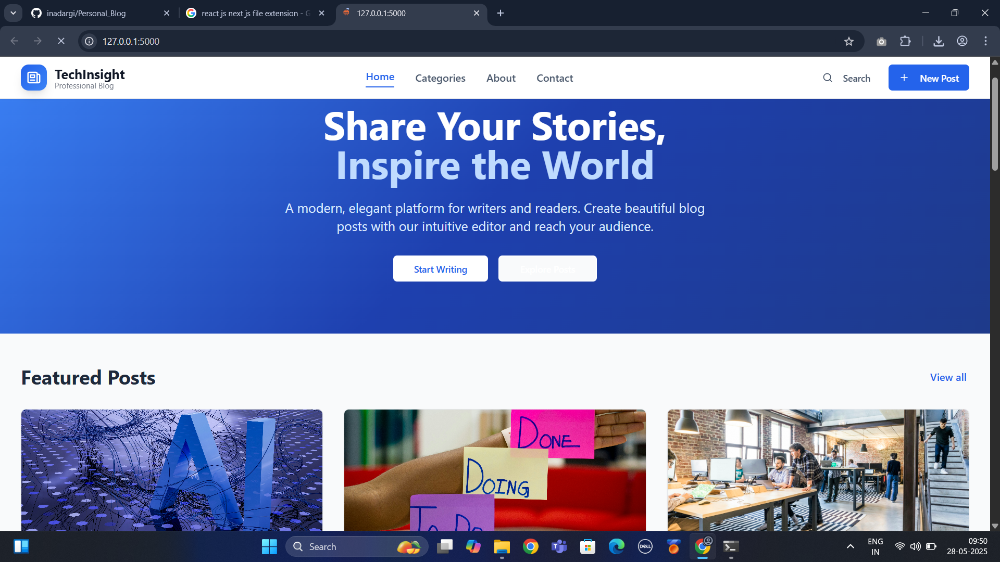
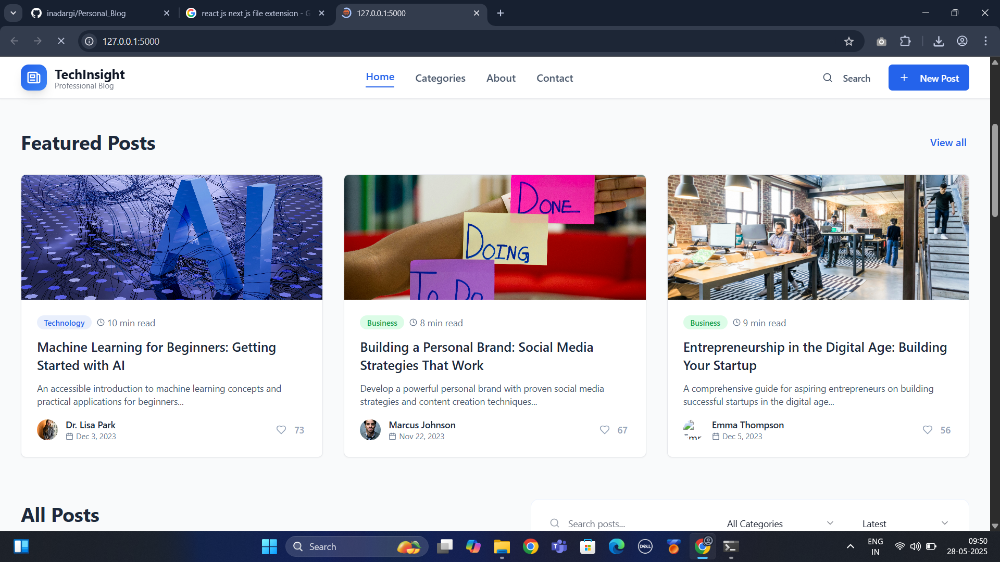
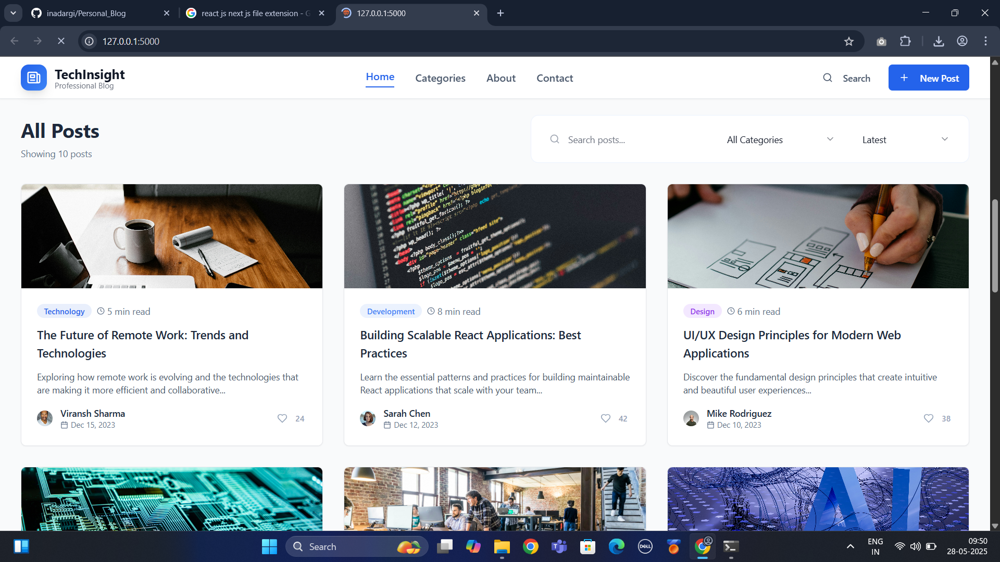

 📝 Blog Listing Website

A fully functional and modern **Blog Listing Web Application** built using **Next.js**, **React**, and **Tailwind CSS**. The app allows users to create, search, like, and delete blog posts, with additional pages like **About** and **Category** for better navigation and structure.

---

 ✨ Features

- 🏠 **Home Page**  
  Displays all blog posts with title, summary, date, and like button.

- ➕ **Add Blog**  
  Create new blog posts using a clean form interface.

- 🔍 **Search Blogs**  
  Real-time search bar to filter blogs by title or content.

- ❤️ **Like Blog**  
  Like/unlike a blog post and see like count.

- 🗑️ **Delete Blog**  
  Remove blog posts directly from the list.

- 📂 **Category Page**  
  View blogs filtered by category (e.g., Tech, Life, Code, etc.).

- ℹ️ **About Page**  
  Static about page with basic app information.


- 🎨 **Tailwind CSS UI**  
  Fully responsive and minimal UI for a smooth user experience.

---

## 🚀 Tech Stack

- **Frontend Framework**: Next.js
- **Library**: React.js
- **Styling**: Tailwind CSS
- **State**: React Hooks (`useState`, `useEffect`)
- **Deployment**: Vercel

---

## 📸 Screenshots

> Place your screenshots in a `screenshots/` folder

### 🏠 Home Page




### ➕ Add Blog


### 🔍 Search Feature


### 📂 Category Page


---

## 🛠️ Getting Started

```bash
# Clone the repo
git clone https://github.com/<your-username>/<your-repo>.git
cd <your-repo>

# Install dependencies
npm install

# Start the dev server
npm run dev
